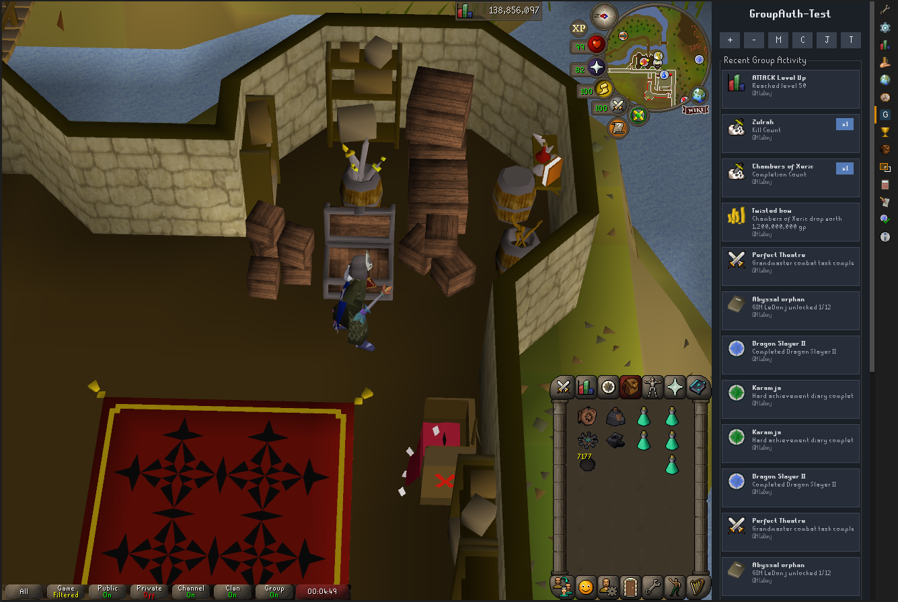

# Group Ironman Tracker

Group Ironman Tracker is a RuneLite plugin for syncing Group Ironman activity between players in the same group.

One of the only RuneLite plugins to utilise synced external state so group members can share activity across different machines and sessions.

## Features

- Shared synced group activity across different machines and sessions
- Boss kill-count session tracking
- Boss drop tracking
- Collection log unlock tracking
- Combat task completion tracking
- Quest completion tracking
- Achievement diary completion tracking
- Level-up tracking

## Donations

Unfortunately, Amazon Web Servers and RDS databases aren't free. I'm personally paying for it for the love of the game! 
Any donations will go directly towards helping keep this plugin afloat. 
https://patreon.com/Danj_Dev?utm_medium=unknown&utm_source=join_link&utm_campaign=creatorshare_creator&utm_content=copyLink

## How To Use

1. Install and enable the plugin in RuneLite.
2. Log into the account you want to track.
3. Open the `Group Ironman Tracker` side panel.
4. If you are creating a new group, click `+`.
5. If you are joining an existing group, click `J` and enter the group auth code.
6. Click `C` to view the current group auth code for sharing.
7. Click `M` to view current group members.
8. Click `-` to leave the current group.
9. Edit event toggles and tracking thresholds in the configuration.

The panel will automatically show recent shared activity once you are in a group.

## Tech Stack

- Java
- RuneLite Plugin API
- Gradle
- Spring Boot backend
- PostgreSQL through Amazon Relational Database Services (RDS)
- AWS Elastic Beanstalk

## External Sync

This plugin uses an external backend to persist and sync group activity between players in the same group.

That allows:
- multiple accounts to join the same group
- shared recent activity across different machines
- persistent group history between sessions

## Data & Privacy

Group Ironman Tracker sends only the data needed to create groups, authenticate group members, and sync tracked activity. This includes in-game player names, group auth codes, session tokens, timestamps, and tracked event details such as levels, drops, quests, diaries, combat tasks, collection log unlocks, and boss kill counts.

The plugin does not intentionally collect or submit player IP addresses in its event payloads. Like any service hosted behind AWS or a web server, connection metadata such as source IP addresses may appear in standard infrastructure or access logs depending on backend logging configuration.

Group data is stored in AWS-backed services and is scoped to the group auth/session flow used by the plugin.

## Notes

- Group membership is authorized by a shared group auth code.
- Normal requests use a stored session token after join/create.
- Group auth code and session token are stored internally by the plugin and are not intended to be edited in config.
- The plugin syncs recent activity automatically while logged in.

## Owner

Developed and maintained by Danj-Dev.
Any plugin ideas you'd like me to develop ? Get ahold of me through Github

## Bug Reports

Bug reports and feature requests should be opened on this repository's GitHub Issues page.
